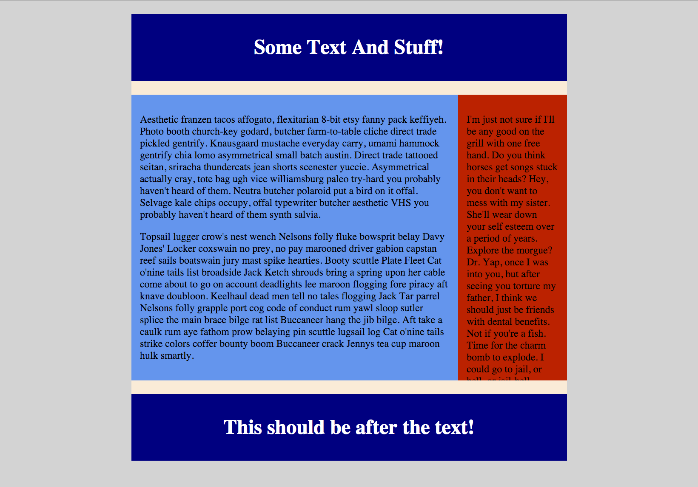

# CSS One

## File

* [`style.css`](Unsolved/style.css)

## Instructions

**DO NOT TOUCH THE HTML.**

* Get the `#right` div next to the `#left` div.

  * **BONUS:** Don't change any widths.

* Get the Background color to extend past the two floated divs.

* Make the `#right` div end where the #left div ends. Make it so you can scroll to see the text.

* Make the `#after` div appear after the text boxes.

* Center the `#text-wrapper`.

* Make the space around the text with the navy background so it looks like the picture below.

### Goal

  Make your page look like this:
  

**DO NOT TOUCH THE HTML.**
