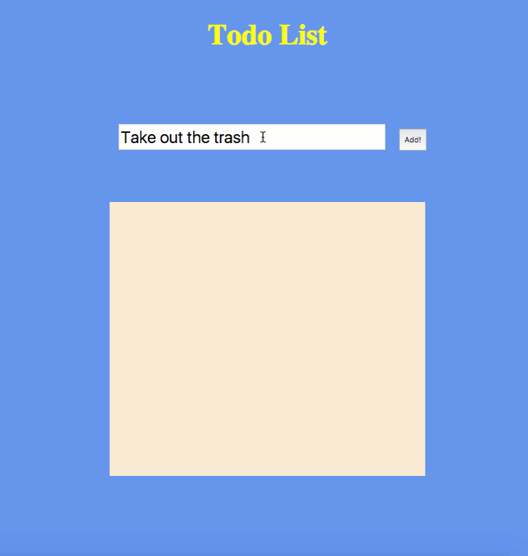

# List App with jQuery

## File

* [`app`](Unsolved/app.js)

## Instructions

* Use the provided starter HTML to make a list app. This app will take text from an input box and display it in another box elsewhere on the page. Add a way to click and delete the entries you add, too.

* **BONUS:**

  * Add a new entry when you press the `return` key;

  * Style it.

## Info

An example of the functionality:

